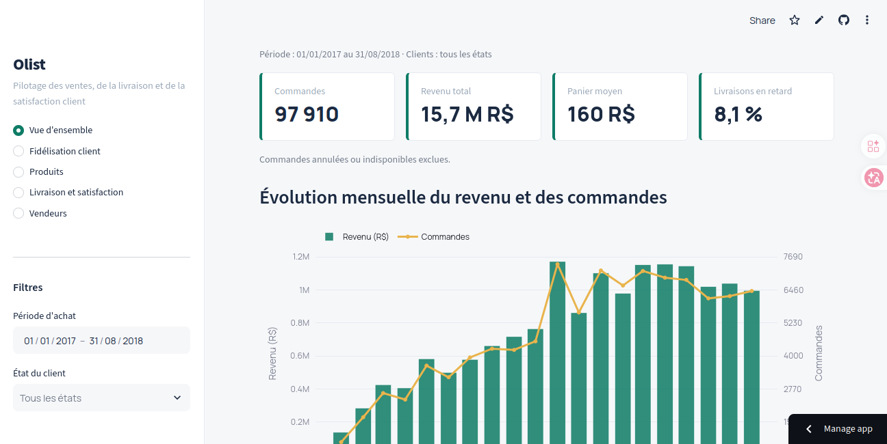
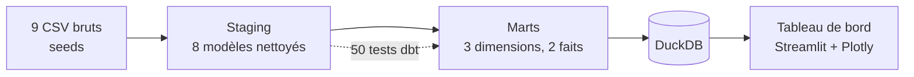
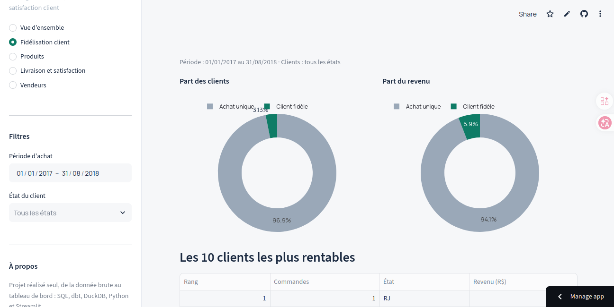

# Olist : pipeline de données et tableau de bord décisionnel

De 9 fichiers CSV bruts à un tableau de bord interactif, avec des transformations versionnées, testées et documentées. Projet réalisé seul, de bout en bout, sur le jeu de données public **Olist Brazilian E-Commerce** (place de marché brésilienne, 2016-2018).

**Tableau de bord en ligne : https://olistdash.streamlit.app/**
(si l'application est en veille, un clic sur le bouton de relance suffit)



## Ce que le projet démontre

- **Ingénierie de données** : chargement, nettoyage SQL et modélisation en couches (staging puis marts) avec dbt.
- **Qualité des données** : 50 tests automatisés, dont des avertissements volontaires sur les défauts connus de la source.
- **Esprit d'analyse** : les anomalies sont isolées et documentées, pas corrigées en silence.
- **Restitution** : un tableau de bord lisible par un décideur non technique, avec filtres et titres qui énoncent le constat.

## Résultats clés

| Constat | Valeur |
|---|---|
| Revenu total (hors commandes annulées ou indisponibles) | environ 15,7 M R$ |
| Clients n'ayant commandé qu'une fois | 97 % |
| Livraisons en retard | environ 8,1 % |
| Catégorie qui rapporte le plus | Santé & beauté |
| Part des 10 meilleurs vendeurs basés à São Paulo | 9 sur 10 |

## Architecture



Stack : **SQL, dbt (dbt-duckdb), DuckDB, Python, Streamlit, Plotly**.

### Choix de conception

- **DuckDB** : moteur analytique embarqué, sans serveur à installer, adapté à ce volume ; le projet se relance en quelques commandes.
- **Séparation staging et marts** : le staging ne fait que nettoyer et renommer ; la logique métier vit uniquement dans les marts.
- **Anomalies signalées, pas effacées** : les 61 commandes livrées aux dates incohérentes portent un indicateur `has_date_anomaly`.
- **Tableau de bord en lecture seule** : il ne peut pas entrer en conflit avec un `dbt build` lancé en parallèle.

## Modèle de données

**Staging** (`models/staging/olist/`) : une table nettoyée par source.

| Modèle | Grain | Particularité |
|---|---|---|
| `stg_olist__orders` | 1 commande | 61 commandes livrées aux dates incohérentes, signalées par `has_date_anomaly` |
| `stg_olist__customers` | 1 commande (côté client) | `customer_id` est technique (un par commande) ; `customer_unique_id` identifie la personne |
| `stg_olist__order_items` | 1 article | clé composée `order_id` + `order_item_id` |
| `stg_olist__payments` | 1 paiement | clé composée `order_id` + `payment_sequential` ; les paiements à 0 R$ sont des bons d'achat |
| `stg_olist__reviews` | 1 couple avis/commande | un `review_id` peut concerner plusieurs commandes |
| `stg_olist__products` | 1 produit | catégorie traduite, avec repli sur le portugais |
| `stg_olist__sellers` | 1 vendeur | |
| `stg_olist__geolocation` | 1 point GPS | 1 000 163 lignes brutes ramenées à 738 332 après suppression des doublons exacts |

**Marts** (`models/marts/core/`) : tables orientées analyse.

| Modèle | Grain | Contenu |
|---|---|---|
| `dim_customers` | 1 client | nombre de commandes, première et dernière commande, segment `one_time` ou `returning` |
| `dim_products` | 1 produit | quantités vendues, revenu |
| `dim_sellers` | 1 vendeur | articles et commandes vendus, revenu |
| `fct_orders` | 1 commande | montants, délai de livraison, retard, note moyenne |
| `fct_order_items` | 1 article | croisement produit, vendeur et commande |

## Qualité des données

**50 tests dbt** : `unique`, `not_null`, `accepted_values`, `relationships` et `dbt_utils.unique_combination_of_columns`.

Dernière exécution de `dbt test` : **48 réussis, 2 avertissements, 0 erreur.**

Les deux avertissements sont volontaires : ils signalent des défauts connus de la source sans bloquer le pipeline.

- **610 produits sans catégorie** ;
- **2 produits sans poids**.

Les tests traduisent les règles réelles des données. Aucun test d'unicité n'est posé sur des colonnes qui se répètent légitimement (`customer_unique_id` dans le staging, `review_id`). L'intégrité entre tables est vérifiée par des tests `relationships` (articles, paiements et avis rattachés à une commande existante ; commandes rattachées à un client).

## Tableau de bord

Cinq sections : vue d'ensemble, fidélisation client, produits, livraison et satisfaction, vendeurs. Les deux premières se filtrent par période et par État. Les montants sont en réais brésiliens (R$).



## Lancer le projet

```bash
git clone https://github.com/Donassigue-soro/projet_dbt.git
cd projet_dbt/projet_dbt
pip install -r requirements.txt

dbt deps      # installe dbt_utils
dbt seed      # charge les 9 CSV
dbt build     # modèles + tests

streamlit run dashboard_olist.py
```

Fermez le tableau de bord (et toute session DuckDB) avant de relancer dbt : DuckDB n'autorise qu'un seul processus en écriture.

## Structure du dépôt

```
projet_dbt/
├── seeds/                   CSV bruts
├── models/
│   ├── staging/olist/       8 modèles + schema.yml (tests et documentation)
│   └── marts/core/          5 modèles + schema.yml
├── analyses/                exploration SQL
├── dashboard_olist.py       application Streamlit
├── packages.yml             dépendances dbt (dbt_utils)
└── dbt_project.yml
```

## Limites et pistes d'amélioration

- ajouter des tests sur les règles métier : date de livraison postérieure à l'achat, montants non négatifs ;
- ajouter un test de fraîcheur si la source devient alimentée en continu ;
- publier la documentation dbt générée (`dbt docs generate`) ;
- le tableau de bord lit un fichier DuckDB local : pour un usage en production, il faudrait un entrepôt partagé (BigQuery, Postgres) et un ordonnanceur.

## Contact

SORO Donassigué Mathieu · sorodonassigue491@gmail.com · https://www.linkedin.com/in/mathieu-soro/